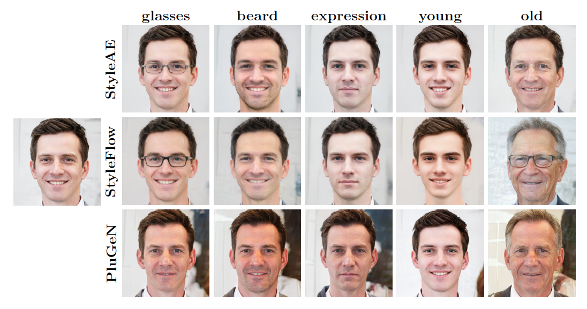

# StyleAutoEncoder

Implementation of paper "StyleAutoEncoder for manipulating image attributes using pre-trained StyleGAN" - Andrzej
Bedychaj, Jacek Tabor, Marek Śmieja (PAKDD 2024)

## Abstract



Deep conditional generative models are excellent tools for creating high-quality images and editing their attributes.
However, training modern generative models from scratch is very expensive and requires large computational resources. In
this paper, we introduce StyleAutoEncoder (StyleAE), a lightweight AutoEncoder module, which works as a plugin for
pre-trained generative models and allows for manipulating the requested attributes of images. The proposed method offers
a cost-effective solution for training deep generative models with limited computational resources, making it a
promising technique for a wide range of applications.
We evaluate StyleAE by combining it with StyleGAN, which is currently one of the top generative models.
Our experiments demonstrate that StyleAE is at least as effective in manipulating image attributes as the
state-of-the-art algorithms based on invertible normalizing flows. However, it is simpler, faster, and gives more
freedom in designing neural architecture.

## Installation

To install, run the following commands (requires Python 3.7+) run the requirements.txt file:

```bash
pip install -r requirements.txt
```

## Datasets

Download and extract the datasets from the following links
[FFHQ dataset](https://drive.google.com/file/d/1Kesr-oQ2XgXd6KZDxJ8Uy04xXZlbBZ0y/view?usp=sharing) and
[AFHQ dataset](https://github.com/clovaai/stargan-v2).

To work with AFHQ dataset one need to run `preprocess_images_afhq.py` scrip to find closest `w` vectors for StyleGAN. Linked FFHQ dataset was already preprocessed by StyleFlow authors.

## Training
To train a new StyleAE on FFHQ dataset, set all the parameters (in code currently) and run training using `train_ae_with_labels.py` script.

```
python train_ae_with_labels.py 
```    

For AFHQ, use the following commands:

```
python  train_ae_with_labels_afhq.py
```
